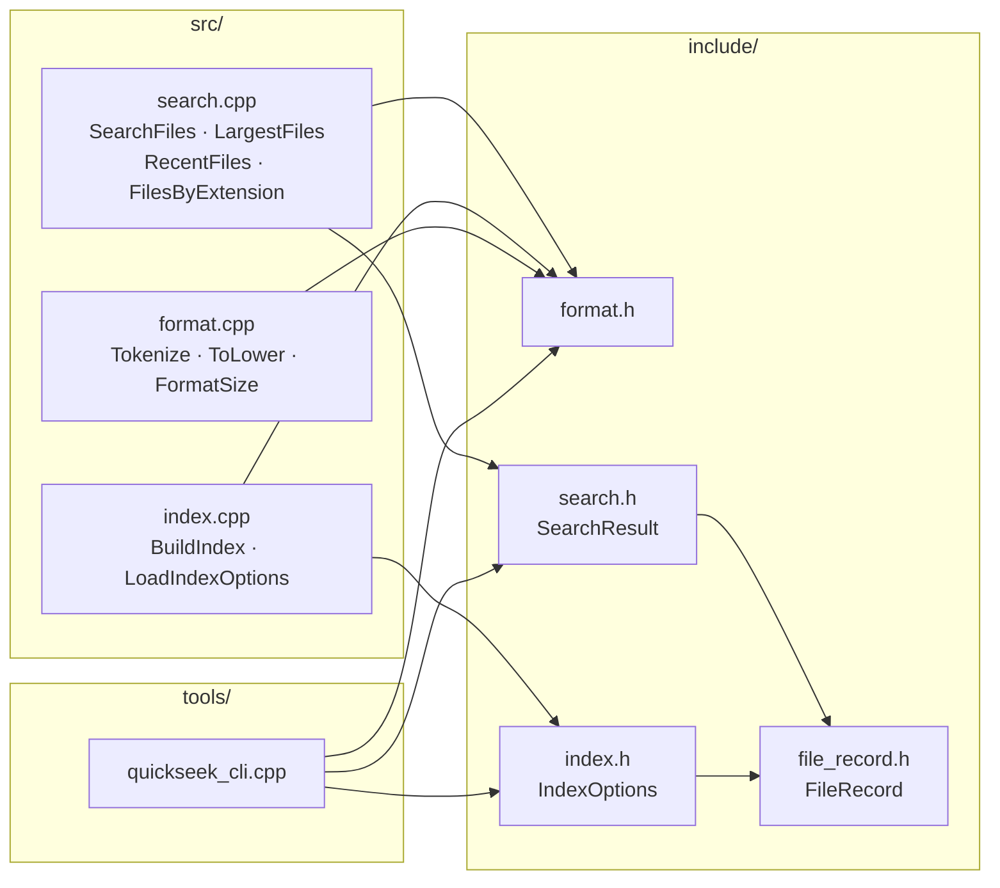

# QuickSeek

QuickSeek is a small C++17 command-line search tool for local files. It scans a directory, builds an in-memory index of filenames and paths, and returns ranked results from an interactive prompt.

The project is intentionally simple, but it is structured like a real C++ library: public headers, private implementation files, a CLI target, CMake presets, and tests.

## Features

- Recursive directory indexing
- Root-level `.quickseekignore` support for skipping generated or unwanted paths
- Filename and folder-path search
- Ranked results with match reasons
- Startup root prompt when no path is provided
- Interactive root switching with `root <path>`
- Explicit rescanning with `rescan`
- Largest-file listing
- Recently modified file listing
- Extension filtering, such as `ext .cpp`
- CTest-based test target

## Requirements

- C++17 compiler
- CMake 3.16 or newer
- Ninja, Make, or another CMake-supported generator

This project is currently developed and tested with GCC via MSYS2 on Windows.

## Building

The recommended build path uses CMake presets.

```powershell
cmake --preset release
cmake --build --preset release
```

The executable is written to:

```text
build/release/quickseek.exe
```

For a debug build:

```powershell
cmake --preset debug
cmake --build --preset debug
```

## Running

Start QuickSeek and choose a root when prompted:

```powershell
.\build\release\quickseek.exe
```

Example startup:

```text
QuickSeek
Choose a folder to scan.
Press Enter for Desktop: C:\Users\<you>\Desktop
Root >
```

Start directly with a specific root:

```powershell
.\build\release\quickseek.exe "%USERPROFILE%\Documents"
```

Inside the prompt:

```text
Search > root
Search > root "%USERPROFILE%\Desktop"
Search > report
Search > large
Search > recent
Search > ext .pdf
Search > rescan
Search > help
Search > exit
```

QuickSeek only searches inside the current root. When you run `root <path>`, it discards the previous index, scans the new folder, and all following searches use that new index.

## Testing

Run the test suite with CTest:

```powershell
ctest --preset release
```

The current tests cover tokenization, ranking behavior, and extension filtering.
They also verify that indexing stays inside the requested root.

## Project Layout

```text
quickseek/
  CMakeLists.txt          Root CMake build file
  CMakePresets.json       Debug and release configure/build/test presets
  include/                Public headers
  src/                    Library implementation
  tools/                  Command-line frontend
  test/                   CTest test executables and support helpers
  docs/                   Usage, design, and testing notes
```

The layout follows the same broad organization used by mature C++ projects such as [Google Benchmark](https://github.com/google/benchmark): public API in `include/`, implementation in `src/`, tests in `test/`, and CMake as the main build entry point.

## Documentation

- [Usage Guide](docs/usage-guide.md)
- [Design Notes](docs/design-notes.md)
- [Testing Guide](docs/testing-guide.md)

## Design

QuickSeek is split into a reusable library and a thin command-line tool.



`BuildIndex()` walks the target directory recursively and creates one `FileRecord` per regular file. Each record stores the file path, name, extension, size, modification time, and searchable tokens.

If the root contains a `.quickseekignore` file, the scanner prunes matching entries while walking. This is faster than indexing everything and filtering later, because ignored directories are not descended into.

`Tokenize()` lowercases names and paths, then splits them into alphanumeric words. For example:

```text
Final_Report_2026.pdf -> final, report, 2026, pdf
```

`SearchFiles()` scores records against a query. Filename prefix matches are ranked highest, filename substring matches come next, and path-token matches are ranked lower. Results are sorted by score before display.

The command-line tool owns the active root and active index. Searching is fast after the scan because queries run against the in-memory records instead of walking the filesystem every time.

Ignore rules are loaded from `.quickseekignore` in the active root. Empty lines and `#` comments are ignored. A rule like `build/` skips a directory, `skip.txt` skips any file or directory with that name, and `docs/private/` skips that relative directory.

## Manual CMake Flow

If you do not want to use presets:

```powershell
cmake -S . -B build -DCMAKE_BUILD_TYPE=Release
cmake --build build --config Release
ctest --test-dir build --build-config Release
```

## Roadmap

- Persist the index to disk for faster startup
- Search inside text files such as `.txt`, `.cpp`, `.md`, and `.log`
- Add fuzzy matching for typo-tolerant search
- Add `open <n>` and `folder <n>` commands for result actions
- Add benchmarks for indexing and query speed

## License

MIT — see [LICENSE](LICENSE).
