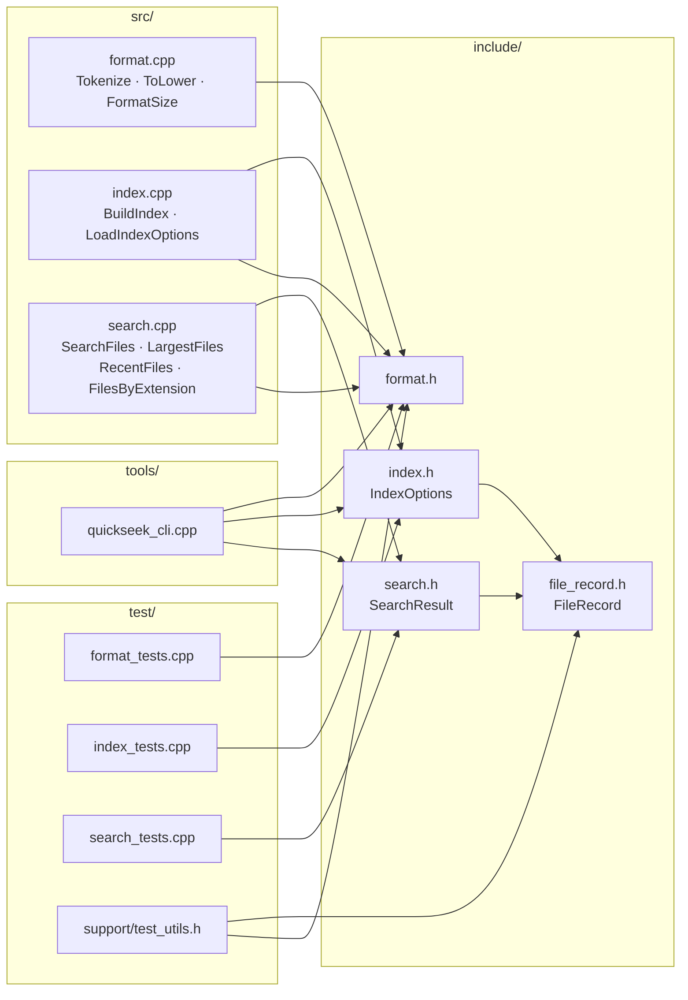
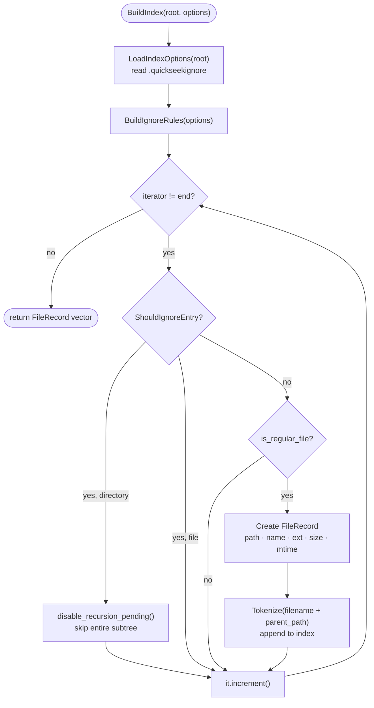
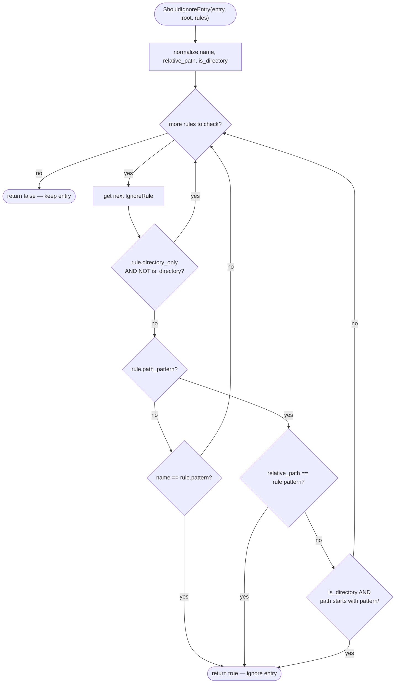
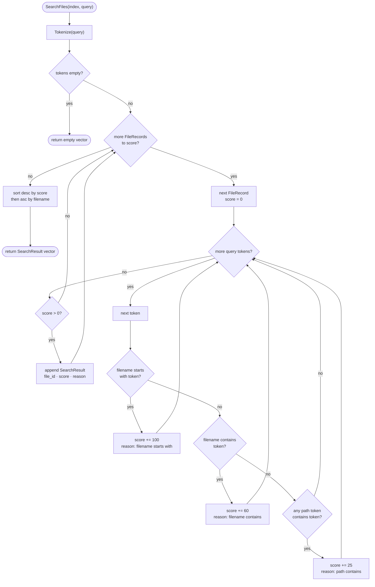

# QuickSeek Design

QuickSeek is a small C++17 library plus a command-line frontend.

## Architecture



The CLI is intentionally thin. It owns the active root and the current index, while the library provides indexing, tokenization, formatting, and search behavior. If no root is passed on the command line, the CLI prompts for one before scanning.

## Indexing

`BuildIndex(root)` recursively walks the selected root and creates a `FileRecord` for each regular file.

The scanner can prune files and directories using rules loaded from `.quickseekignore` in the selected root. There are no built-in ignored directory names; the ignore file is the source of truth.

Directory pruning happens during traversal with `disable_recursion_pending()`, so ignored folders are not scanned at all.

Each record contains:

- numeric id
- full path
- filename
- extension
- file size
- modification time
- lowercase searchable tokens

The index is currently stored in memory. Changing roots or running `rescan` rebuilds it.

`IndexOptions` can be used by callers to provide ignore patterns directly or to change the ignore file name.



## Ignore Rules

Ignore rules are line based:

- empty lines are skipped
- lines starting with `#` are comments
- `build/` ignores a directory named `build`
- `debug.log` ignores any file or directory with that name
- `docs/private/` ignores a relative directory under the root

Patterns are matched case-insensitively.



## Search

`SearchFiles(index, query)` tokenizes the query and scores each record:

- filename starts with token: high score
- filename contains token: medium score
- path token contains token: lower score

Results are sorted by score, then filename.



## Root Scope

The selected root defines the search boundary. QuickSeek does not scan sibling folders unless the user sets a higher root that contains them.

For example:

```text
root C:\Users\<you>\Desktop\cppsomething
```

Only files under `cppsomething` are indexed.

## Future Work

- Persistent index file
- Incremental rescan
- File content search
- Fuzzy matching
- Benchmarks for scan and query time
